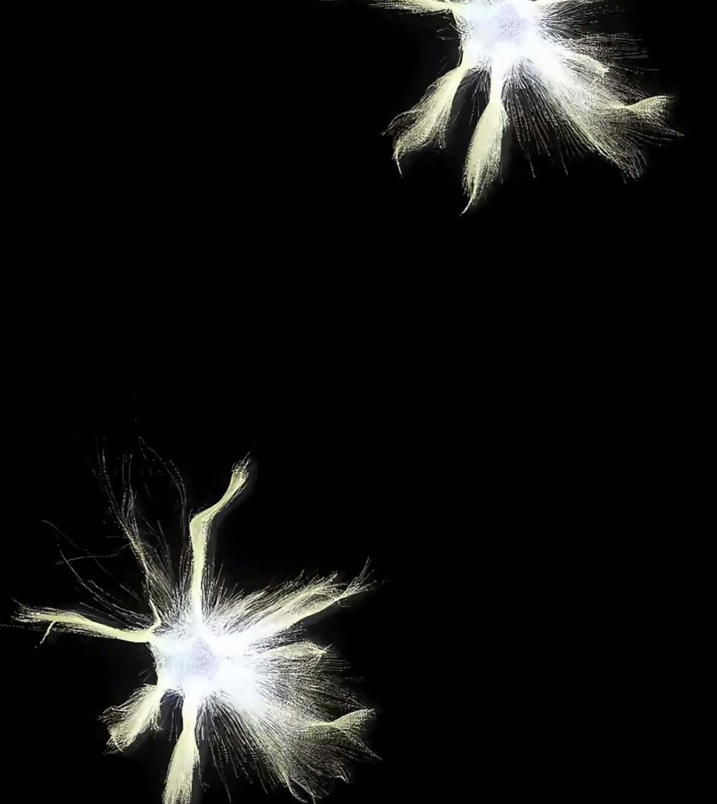
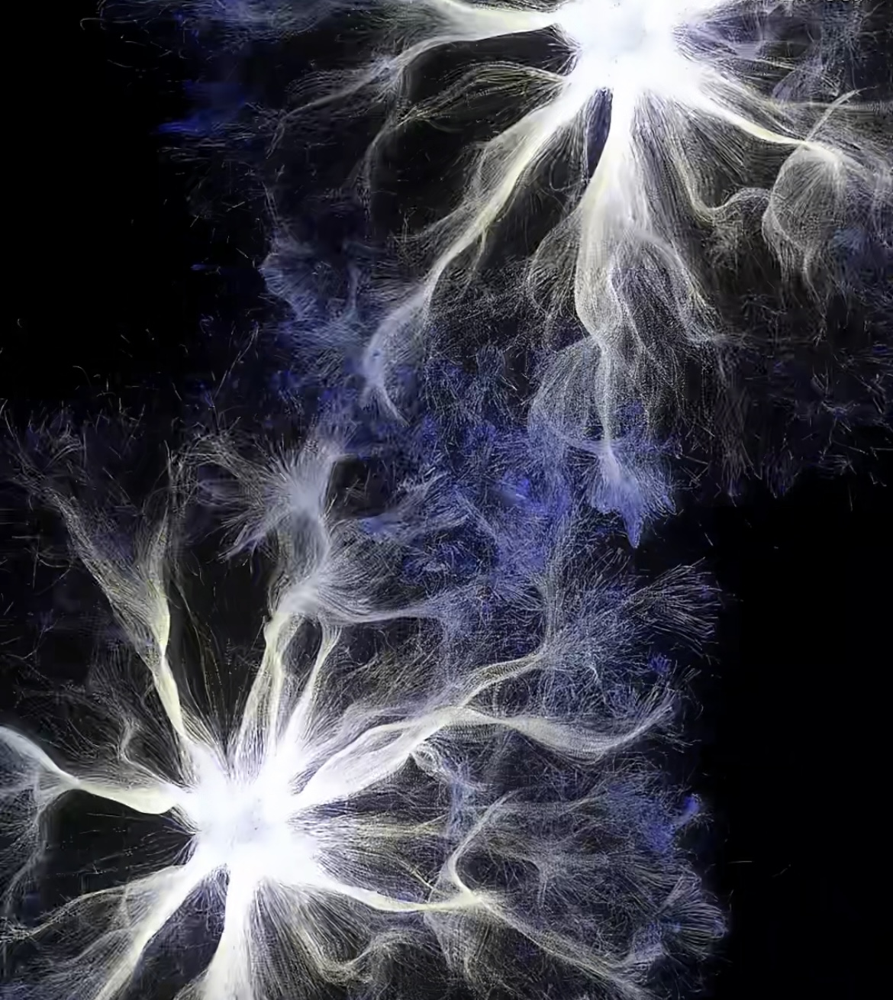
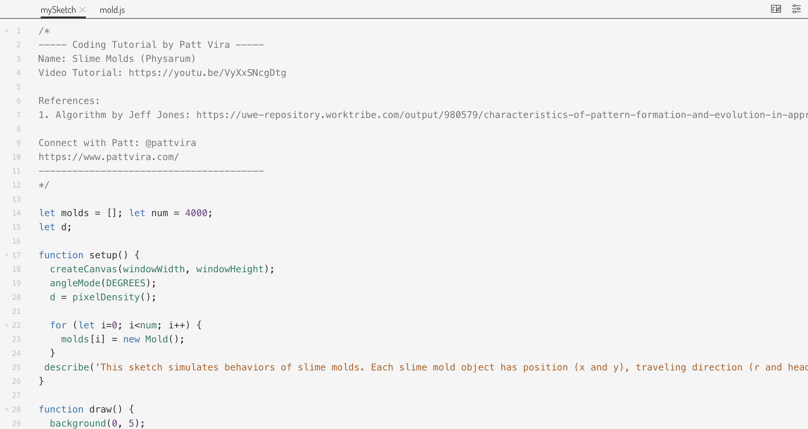
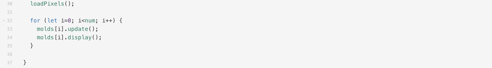
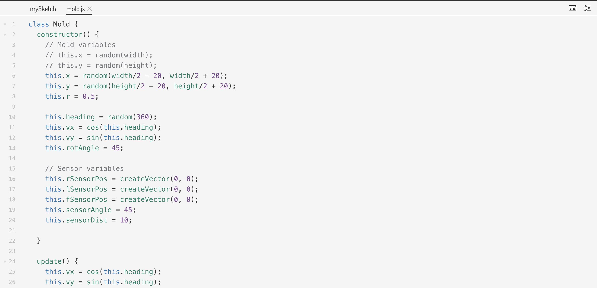
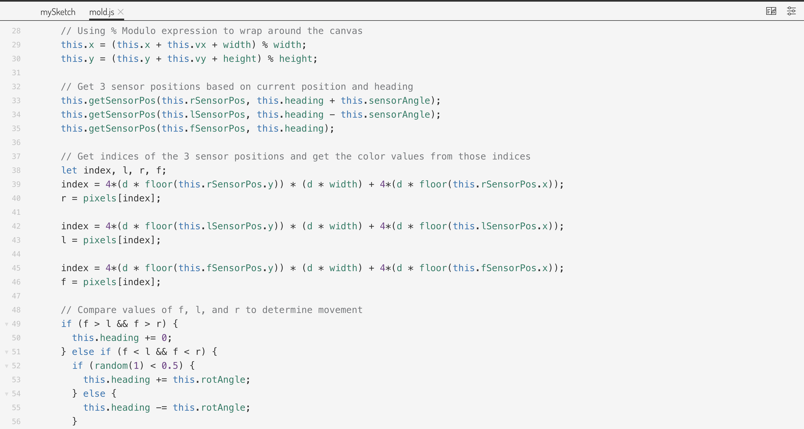
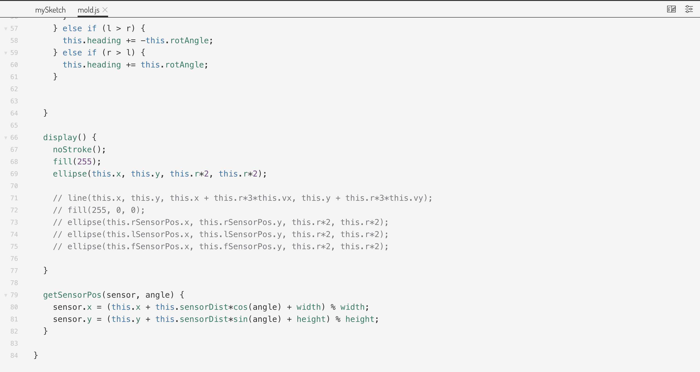
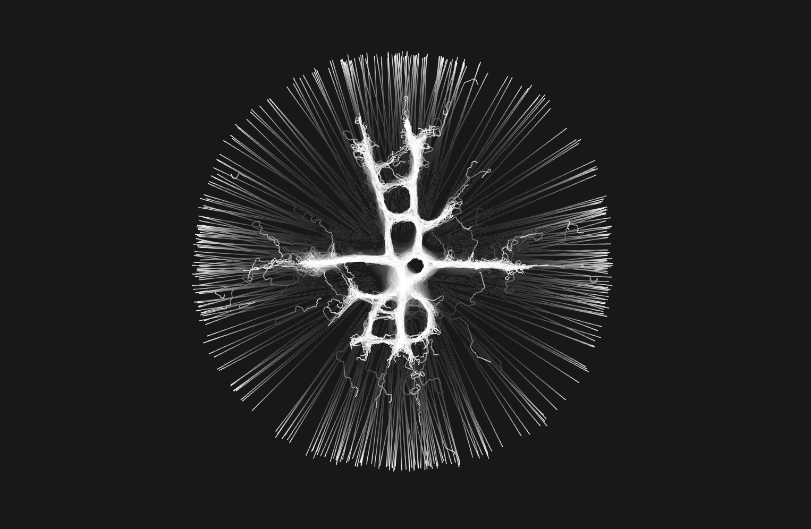
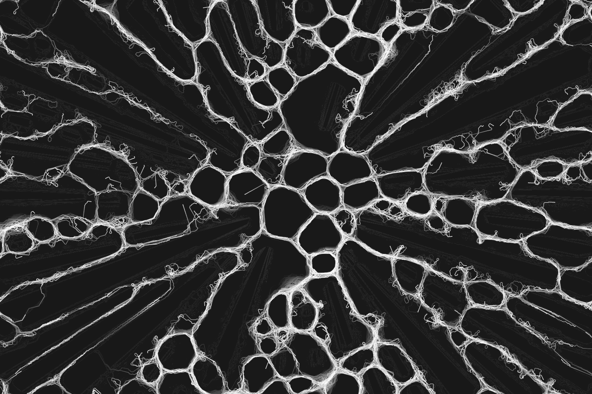

# swan0267_9103_TUT02

# The Modern Saint-Georges Majeur

## Selected Artwork

## Part 1: Inspiration
City’s various parts collaborate like brain to maintain the city's vitality (Jacobs, 1961). Every day city generates vast amounts of data. These data revolutionize the way we live and work, give us a more intelligent and interconnected city (Townsend, 2013).
I want to keep the form of lines spreading from a single point, linking together, and finally forming a complete image from this artwork. Because I want to express the constantly generated and connected data in the city like neurons in the brain, making the city smarter and finally constructing a new city.

### Links
[Inspiration artwork](http://xhslink.com/a/Fs7036jQtQxW)

## Part 2: Coding Exploration
Using the update( ) function to update every point’s vx and vy velocities, and move along the pixel value trajectory detected by the sensors through the getSensorPos( ) function, continuously adjusting its heading direction and using the display( ) function to draw points’ positions. By continuously invoking the draw( ) function and updating pixel information via loadPixels( ), the movement paths of the points dynamically generate lines, eventually forming shapes.

### Links
[Coding](https://p5js.org/sketches/2213463/)

## Reference
Jacobs, J. (1961). The death and life of great American cities. Random House.

Townsend, A. M. (2013). Smart cities: Big data, civic hackers, and the quest for a new utopia. W. W. Norton & Company.